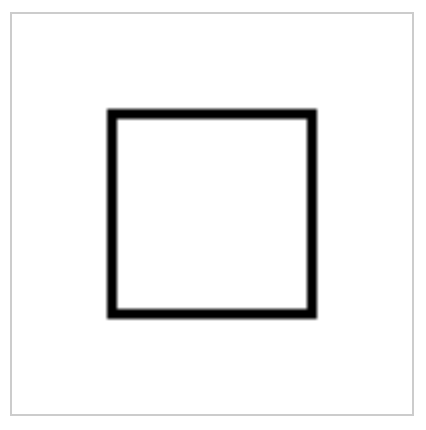
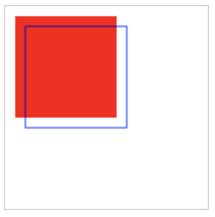

## 矩形

1. fillRect()
2. strokeRect()
    1. Line Width
3. Rectangle Color

在Canvas 中最容易绘制的图形就是矩形了，你可以使用 fillRect()和 storkeRect() 方法进行绘制, 先看看一个例子：

```js
let canvas = document.getElementById('k-canvas')
let context = canvas.getContext("2d")

context.fillStyle="#ff0000"
context.fillRect(10, 10, 100, 100);

context.strokeStyle = '0000ff';
context.strokeRect(20, 20, 100, 100);
```

#### fillRect()

fillRect()方法通过 左上角的坐标以及给定的宽度和高度绘制矩形。 需要注意的是Canvas的坐标系是从0,0开始，即x轴向右增加，y向上增加。
其参数如下

```
fillRect(x, y, width, height)
```

### strokeRect()

strokeRect() 用来绘制一个未填充的矩形，方法参数同fillRect()一致

### Line Width

使用strokeRect()可以设置边框宽度，示例如下：

```js
var x = 50;
var y = 50;
var width  = 100;
var height = 100;

context.lineWidth = 5;
context.strokeRect(x, y, width, height);
```



## rectangle Color

绘制矩形时，可以通过使用 fillStyle 或者 strokeStyle 属性设置颜色

```js
var canvas  = document.getElementById("ex1");
var context = canvas.getContext("2d");

context.fillStyle = "#ff0000";
context.fillRect(10,10, 100,100);

context.lineWidth   = 4;
context.strokeStyle = "#0000ff";
context.strokeRect(30,20, 120,110);
```

