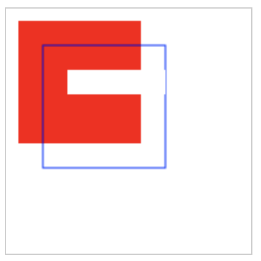

## clearRect()

clearRect()用来清除指定的矩形， 清除的矩形变成透明，示例如下：

```js
let canvas = document.getElementById('k-canvas')
let context = canvas.getContext('2d')

context.fillStyle="#ff0000"
context.fillRect(10, 10, 100, 100)

context.strokeStyle="#0000ff"
context.strokeRect(30,30, 100, 100)

context.clearRect(50, 50, 80, 20)
```




## clearRect(x, y, width, height)

就像绘制矩形一样， 清除矩形也需要指定左上角的坐标以及矩形的宽高

```js
var x = 50;
var y = 30;
var width  = 110;
var height = 25;

context.clearRect(x, y, width, height);
```