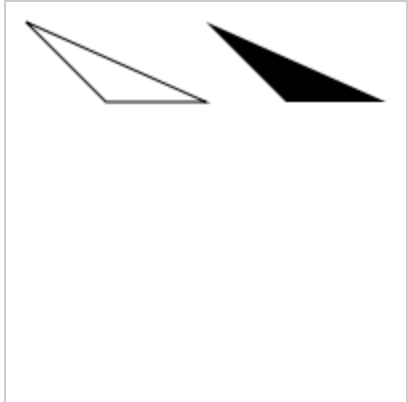
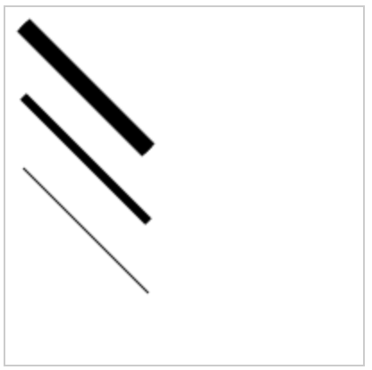
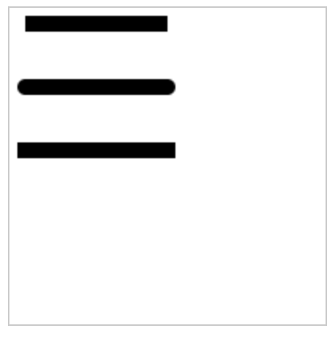
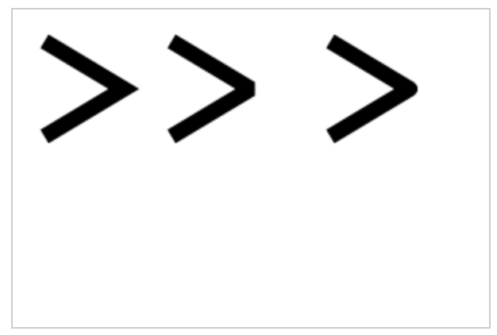
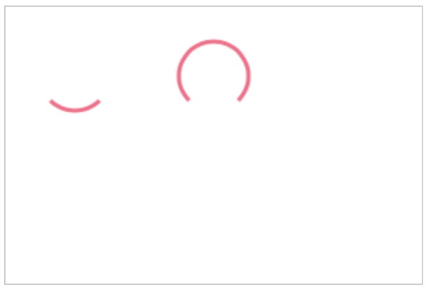

## Paths

Path 是由一系列的点合成的，他们可以构成线或者弧形。  Path在Canvas中用来绘制多种形状(线条、原型、多边形)，因此 Path是一个非常重要的概念

### 开始和关闭Path

可以通过调用 beginPath() 和 closepath() 实现开始和关闭Path

### moveTo()

将默认的绘制坐标移动到指定坐标

```js
context.moveTo(10,10);
```

### lineTo()

从Path的绘制坐标点回一条线到指定的坐标

```js
context.beginPath();

context.moveTo(10, 10);
context.lineTo(50,50);

context.closePath();
```


### stroke() + fill()

实际上在调用 stroke() 或者 fill()之前， path 并不会生成真正的路径，因此是不可见的。调用 stroke()将之前Path绘制成线，而调用后者，将之前的Path填充为图形。

stroke() 方法会将之前的线条绘制成一个非填充的图形。
fill() 方法会讲之前的线条绘制成一个填充的图形。

下面是一个例子，分别用来说明 stroke() 和 fill()的效果

```js
context.beginPath();
context.moveTo(10, 10);
context.lineTo(50, 50);
context.lineTo(100, 50);
context.lineTo(10,10);
context.stroke();
context.closePath();

context.beginPath();
context.moveTo(100, 10);
context.lineTo(140, 50);
context.lineTo(190, 50);
context.lineTo(100,10);
context.fill();
context.closePath();
```



### Line Width

通过设置 lineWidth 可以控制线条宽度

```js
context.beginPath();
context.lineWidth =10;
context.moveTo(10,10);
context.lineTo(80, 80);
context.stroke();

context.lineWidth= 5;
context.moveTo(10, 50);
context.lineTo(80, 120);
context.stroke();

context.lineWidth =1;
context.moveTo(10, 90);
context.lineTo(80, 160);
context.stroke();

context.closePath();
```



### Line Cap

画线条时可以通过 lineCap 指定线条两端的样式。

1. butt
2. round
3. square

butt 为 lineCap默认属性， 当设置 round、square时，是给线条两端增加了一些“装饰”其长度是线条宽度的1/2. 

```js
ctx.lineCap = 'butt';
ctx.lineWidth =10;

ctx.beginPath();
ctx.moveTo(10, 10);
ctx.lineTo(100, 10);
ctx.stroke();
ctx.closePath();

ctx.lineCap = 'round'
ctx.beginPath();
ctx.moveTo(10, 50);
ctx.lineTo(100,50);
ctx.stroke();
ctx.closePath();


ctx.lineCap = 'square';
ctx.beginPath();
ctx.moveTo(10, 90);
ctx.lineTo(100,90);
ctx.stroke();
ctx.closePath();
```



# Line Join 

两条线汇合点称之为 “Line Join”, 其属性 lineJoin 有以下值：

1. miter
2. bevel
3. round

示例如下

```js
ctx.lineWidth =10;
ctx.lineJoin = 'miter';

ctx.beginPath();
ctx.moveTo(20,20);
ctx.lineTo(70,50);
ctx.lineTo(20,80);
ctx.stroke();
ctx.closePath();

ctx.lineJoin= 'bevel'
ctx.beginPath();
ctx.moveTo(100,20);
ctx.lineTo(150,50);
ctx.lineTo(100,80);
ctx.stroke();
ctx.closePath();

ctx.lineJoin = 'round'
ctx.beginPath();
ctx.moveTo(200, 20);
ctx.lineTo(250, 50);
ctx.lineTo(200, 80);
ctx.stroke();
ctx.closePath();
```



### arc()

使用 arc() 可以绘制弧度,其参数如下：

* x: 弧度中心点x坐标
* y: 弧度中心点y坐标
* radius: 弧度的半径
* startAngle: 弧开始的弧角度
* endAngle: 弧结束的弧角度
* anticlockwise: 是否按照逆时针绘制

示例如下

```js

 ctx.lineWidth = 3;

let x = 50;
let y =50;
let radius = 25;
let startAngle = (Math.PI/180)*45;
let endAngle = (Math.PI/180) *135;
var anticlockwise = false;

ctx.strokeStyle="#fc6689";
ctx.beginPath();
ctx.arc(x, y, radius, startAngle, endAngle, anticlockwise);
ctx.stroke();
ctx.closePath();


x = 150;
y =50;
radius = 25;
startAngle = (Math.PI/180)*45;
endAngle = (Math.PI/180) *135;
anticlockwise = true;


ctx.strokeStyle="#fc6689";
ctx.beginPath();
ctx.arc(x, y, radius, startAngle, endAngle, anticlockwise);
ctx.stroke();
ctx.closePath();
```



> 思考题： 如果要画一个圆，怎么画呢？，其实只需要将 startAngle设置为0， endAngle设置为 (Math.PI/180) *360。;